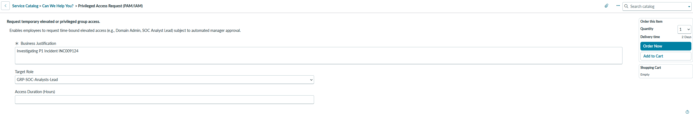
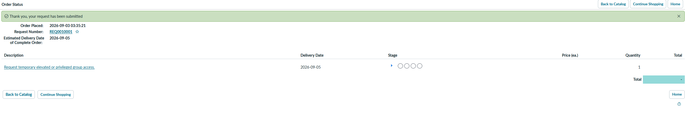
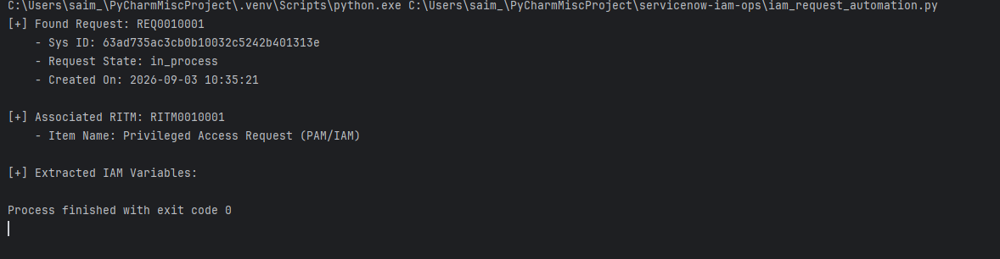

# ServiceNow IAM Operations Automation

## Overview
This project automates the retrieval and parsing of Identity & Access Management (IAM) catalog requests from ServiceNow. It authenticates using OAuth 2.0, traverses parent-child record relationships (sc_request to sc_req_item), and extracts relevant catalog item variables for automated downstream processing.

## ServiceNow Prerequisites & Configuration

Before running the script, configure your ServiceNow Personal Developer Instance (PDI):

1. OAuth Application Registry:

* Navigate to System OAuth > Application Registry.
* Click New > Create an OAuth API endpoint for external clients.
* Set Accessible from to All application scopes.
* Set Scope Restriction to Unscoped (allows access to core Table APIs).
* Save and retain the generated Client ID and Client Secret.

2. User Permissions:
* Ensure the API user has the required roles (e.g., admin or custom read access to sc_request and sc_req_item).

## Installation & Setup

1. Clone the Repository:
   ```git clone https://github.com/your-username/servicenow-iam-automation.git
cd servicenow-iam-automation
```
2. Set Up Virtual Environment:
```python -m venv .venv
source .venv/bin/activate  # On Windows: .venv\Scripts\activate
```
3. Install Dependencies:
   ```pip install requests
   ```

## Usage
1. Open iam_request_automation.py and set your credentials using raw string literals to prevent string corruption from special characters:
   ```INSTANCE_URL = "https://your-instance.service-now.com"
CLIENT_ID = "YOUR_CLIENT_ID"
CLIENT_SECRET = r'''YOUR_CLIENT_SECRET'''
USERNAME = "your_api_username"
PASSWORD = r'''YOUR_API_PASSWORD'''
```
2. Run the automation script:
```python iam_request_automation.py
```

## ServiceNow Prerequisites & Configuration

### 1. Catalog Item & Request Creation
Before running the automation script, create and order the target catalog item in your ServiceNow instance:


*Figure 1: Submitting the Privileged Access Request (PAM/IAM) catalog item with user variables.*


*Figure 2: Order confirmation showing generated Request ID (`REQ0010001`).*

### 2. OAuth Application Registry Setup
* Navigate to **System OAuth** > **Application Registry**.
* Click **New** > **Create an OAuth API endpoint for external clients**.
* Set **Accessible from** to `All application scopes`.
* Set **Scope Restriction** to `Unscoped` (allows core Table API queries).

## Sample Output
Below is the console output from running `iam_request_automation.py` after the request is created:


